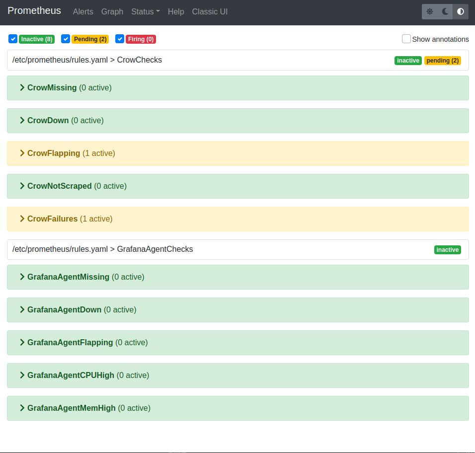
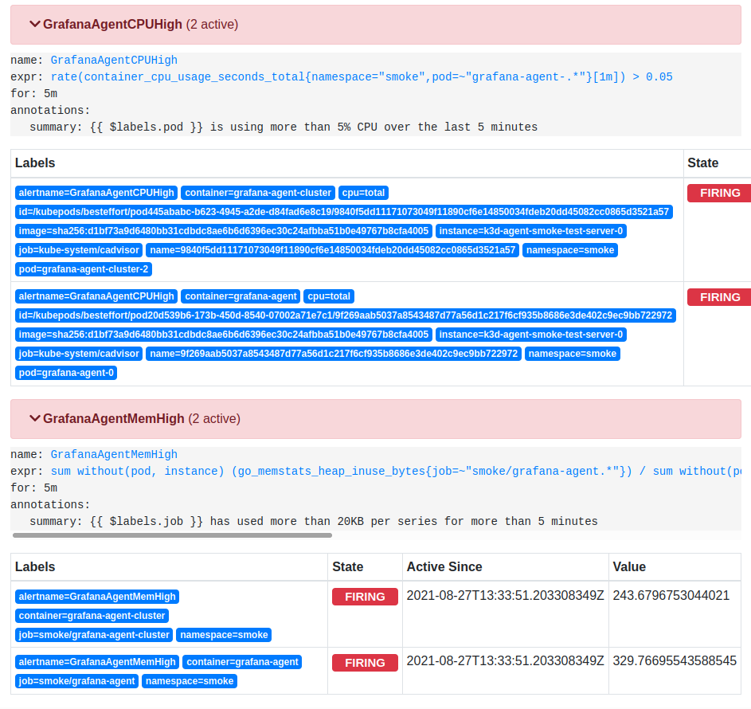
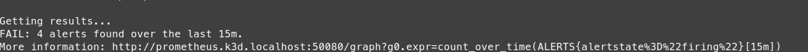
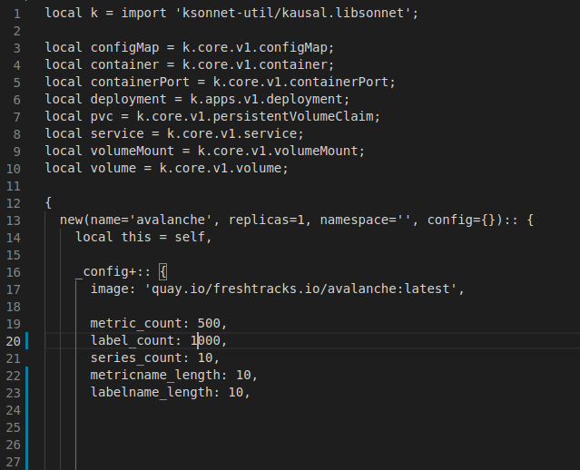
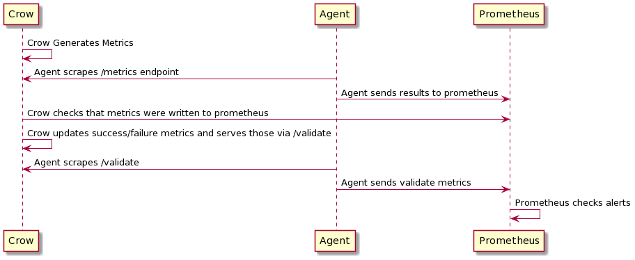

# Crow

Crow is a tool similiar to Tempo Vulture and Loki Canary that is used to smoke test Grafana Agent.

## Running

Crow is ran via `example/k3d/scripts/smoke-test.bash`. This tool will spin up cluster of Grafana Agent, Cortex, Avalanche and Crow instances. The spin up process may take a few minutes before the cluster is ready. Every 30 minutes the smoke test will delete an agent and replica to introduce instability to the system. The impact to the alerts should not change. The test duration can be changed via the -t flag, `./smoke-test.bash -t 45m`. Old K3d clusters can be deleted with `./smoke-test.bash -d`

## What to look for?

These alerts are viewable [here](http://prometheus.k3d.localhost:50080/alerts).

Prometheus alerts are triggered:
- If any Crow instances are not running or Crow samples are not being propagated correctly. 
- If any Grafana Agents are nor or system limits are outside their norm.

NOTE: The alerts might be in pending until the system settles down. 

An alert firing will look similar to the below.

If at the end of the test any issues are found they will look similar to the below.

## How to trigger an alert?

Changing the avalanche setting for label_count to 1000, located [here](example/k3d/lib/avalanche/main.libsonnet). This will ensure the [GrafanaAgentMemHigh](http://prometheus.k3d.localhost:50080/graph?g0.expr=ALERTS%7Balertname%3D%22GrafanaAgentMemHigh%22%7D&g0.tab=1&g0.stacked=0&g0.show_exemplars=0.g0.range_input=1h.) alert exceeds the limit. 

## Architecture

By default, a k3d cluster will be created running the following instances

- agent-single - single instance
- agent-cluster - 3 Grafana Agents in clustered configuration
- crow-cluster - serves the agent cluster
- crow-single - serves the single agent
- cortex
- avalanche - selection of avalanche instances serving traffic

Crow instance will check to see if the metrics that were scraped shows up in the prometheus endpoint and then will emit metrics on the success of those metrics. This success/failure result will trigger an alert if it is incorrect. 

### Flow

Crow uses two endpoints; the traditional `metrics` and then `validate` that generates the results of Crow checking for successful samples. 

### Avalanche

Avalanche is used to add some additional load on the system and general testing. 