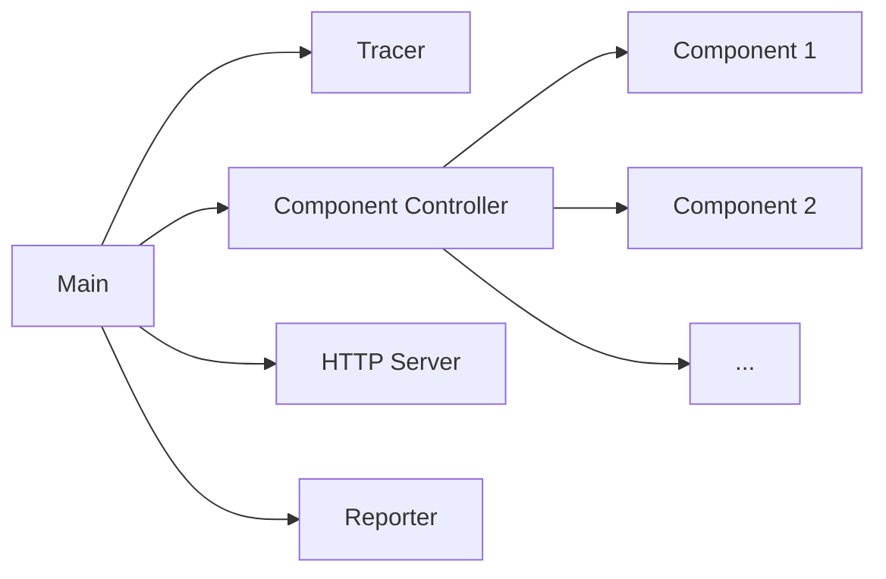

# Concurrency

Grafana Agent Flow makes heavy use of concurrency to run tasks and communicate between them. This page discusses the big picture concurrency used by Flow but it is not all encompassing for concurrency in Flow. For example, a component is very likely to use concurrency to run additional subtasks.

# Main

This is the entrypoint for Flow. It determines the run mode and for flow launches the following tasks:
- Tracer
- Component Controller
- HTTP Server
- Reporter

# Tracer

The [Tracer](../../sources/flow/reference/config-blocks/tracing.md) emits traces for itself that can be forwarded another component that accepts `otelcol` tracers.

# Component Controller

The [Component Controller](../../sources/flow/concepts/component_controller.md) manages components at runtime.

# HTTP Server

Starts an HTTP server with endpoints for:
- Prometheus compatible metrics for the [Component Controller](../../sources/flow/monitoring/controller_metrics.md) and its [Components](../../sources/flow/monitoring/component_metrics.md)
- Reloading config
- The [Graph UI](../../sources/flow/monitoring/debugging.md) for debugging
- etc.

# Reporter

The Reporter sends occassional usage stats to grafana.com. It can be managed using the [command line](../../sources/flow/reference/cli/run.md).

# Component

[Components](../../sources/flow/concepts/components.md) are the building blocks of Grafana Agent Flow. Component specific details can be found [here](../../sources/flow/reference/components/).