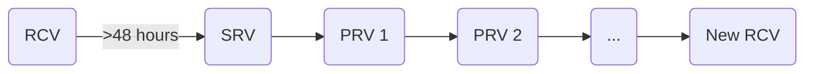

# Releasing

This document describes the process of creating a release for the
`grafana/agent` repo. A release includes release assets for everything inside
the repository, including Grafana Agent and Grafana Agent Operator.

The processes described here are for v0.24.0 and above.

# Prerequisites

These [Prerequisites](./prerequisites.md) should be done by the release shepherd 
before taking any actions.

# Workflows

Once a release is scheduled, a release shepherd is determined. This person will be 
responsible for ownership of the following workflows:

- Release Candidate Publish
  - [Actions] 1-4,6-7,9
- Additional Release Candidate[s] Publish
  - [Actions] 2-4,6-7,9
- Stable Release Publish
  - [Actions] 2-9
- Patch Release Publish (latest version)
  - [Actions] 2-6,8-9
- Patch Release Publish (older version)
  - Not documented yet (but here are some hints)
      - somewhat similar to Patch Release Publish (latest version)
      - find the old release branch
      - cherry-pick commit[s] into it
      - don't update the version in the project on main
      - changes go into the changelog under the patch release version plus stay in unreleased
      - don't update the `release` branch
      - don't publish in github as latest release
      - don't update deployment tools or helm charts

# Actions

1. [Create Release Branch](./1-create-release-branch.md)
2. [Cherry Pick Commits](./2-cherry-pick-commits.md)
3. [Update Version in Code](./3-update-version-in-code.md)
4. [Tag Release](./4-tag-release.md)
5. [Update Release Branch](./5-update-release-branch.md)
6. [Publish Release](./6-publish-release.md)
7. [Test Release](./7-test-release.md)
8. [Update Helm Charts](./8-update-helm-charts.md)
9. [Announce Release](./9-announce-release.md)

[Actions]: #Actions

# Release Cycle

A typical release cycle is to have a Release Candidate published for at least 48 
hours followed by a Stable Release. 0 or more Patch Releases may occur between the Stable Release
and the creation of the next Release Candidate.

RCV = Release Candidate Version

SRV = Stable Release Version

PRV = Patch Release Version
