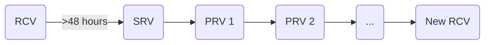

# Releasing

This document describes the process of creating a release for the
`grafana/agent` repo. A release includes release assets for everything inside
the repository, including Grafana Agent and Grafana Agent Operator.

The processes described here are for v0.24.0 and above.

# Prerequisites

These [Prerequisites](./prerequisites.md) should be done by the release shepherd 
before taking any actions.

# Workflows

Once a release is scheduled, a release shepherd is determined. This person will be 
responsible for ownership of the following workflows:

- Release Candidate Publish
  - [Actions] 1-3,5-6,8
- Additional Release Candidate[s] Publish
  - [Actions] 2-3,5-6,8
- Stable Release Publish
  - [Actions] 2-8
- Patch Release Publish (latest version)
  - [Actions] 2-5,7-8
- Patch Release Publish (older version)
  - TODO - This requires a number of similar but unconventional steps outside of this documentation.

# Actions

1. [Create Release Branch](./1-create-release-branch.md)
2. [Update Version in Code](./2-update-version-in-code.md)
3. [Tag Release](./3-tag-release.md)
4. [Update Release Branch](./4-update-release-branch.md)
5. [Publish Release](./5-publish-release.md)
6. [Update Deployment Tools](./6-update-deployment-tools.md)
7. [Update Helm Charts](./7-update-helm-charts.md)
8. [Announce Release](./8-announce-release.md)

[Actions]: #Actions

# Release Cycle

A typical release cycle is to have a Release Candidate published for at least 48 
hours followed by a Stable Release. 0 or more Patch Releases may occur between the Stable Release
and the creation of the next Release Candidate.

RCV = Release Candidate Version

SRV = Stable Release Version

PRV = Patch Release Version
