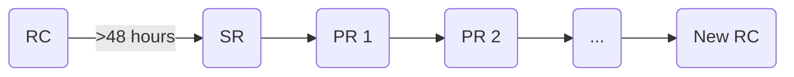

# Releasing

This document describes the process of creating a release for the
`grafana/agent` repo. A release includes release assets for everything inside
the repository, including Grafana Agent and Grafana Agent Operator.

The processes described here are for v0.24.0 and above.

# Prerequisites

These [Prerequisites](./prerequisites.md) should be done by the release shephard 
before taking any actions.

# Actions

Once a release is scheduled, a release shepard is determined. This person will be 
responsible for ownership of the following actions:

1. [Create Release Branch](./create-release-branch.md)
2. [Update Version](./update-version.md)
2. [Create Release Candidate](./create-release-candidate.md)
3. [Publish Release Candidate](./publish-release-candidate.md)

A typical release cycle is to have a Release Candidate published for at least 48 
hours followed by a Stable Release. 0 or more Patch Releases may occur between the Stable Release
and the creation of the next Release Candidate.

RC = Release Candidate

SR = Stable Release

PR = Patch Release