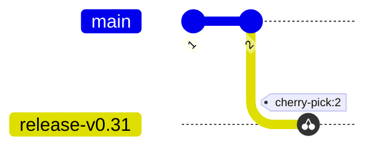
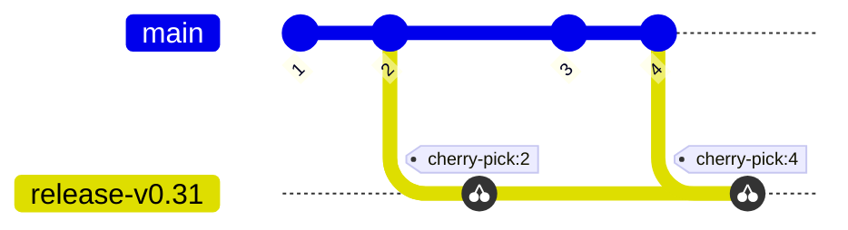

# Create Release Branch

This is the first step taken as release shephard after [Prerequisites](./prerequisites.md) are met. This branch will be used for the Release Candidates, Stable Release and Patch Releases.

1. Gather consensus on which commit should be used as a base for the release
   branch.

2. Create and push the release branch from the selected base commit:

   * The name of the release branch should be the name of the stable version we intend 
   to release, such as `release-v0.31`.
   * Release branches do not contain the `-rc.N` release candidate suffix. This means
     there is no branch called `release-v0.31-rc.0`.
   * Release branches do not contain the patch version. This means there is no 
     branch called `release-v0.31.0` or `release-v0.31.4`.

3. Create a PR to cherry-pick additional commits into the release branch as
   needed. 

4. Create a PR to [update code](#updating-code) on `main` using the `-rc.N` release
   candidate version.