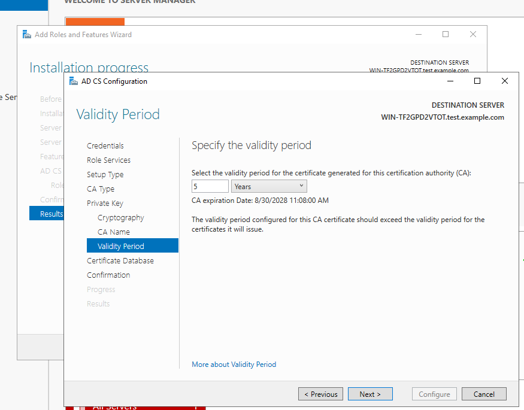
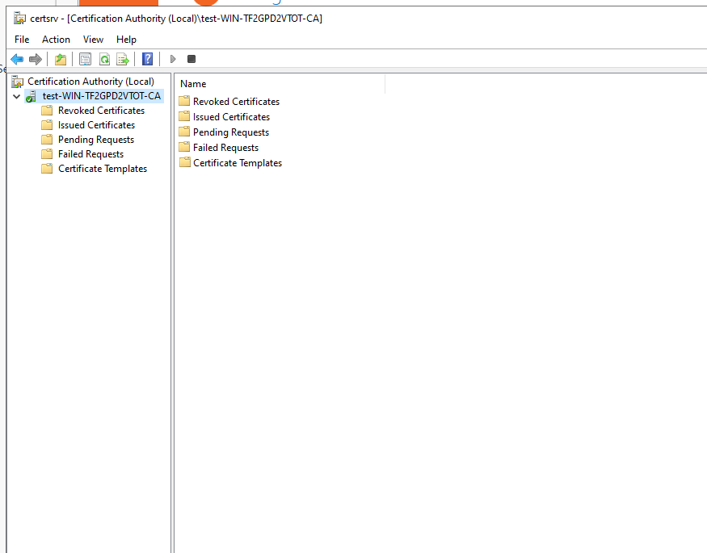
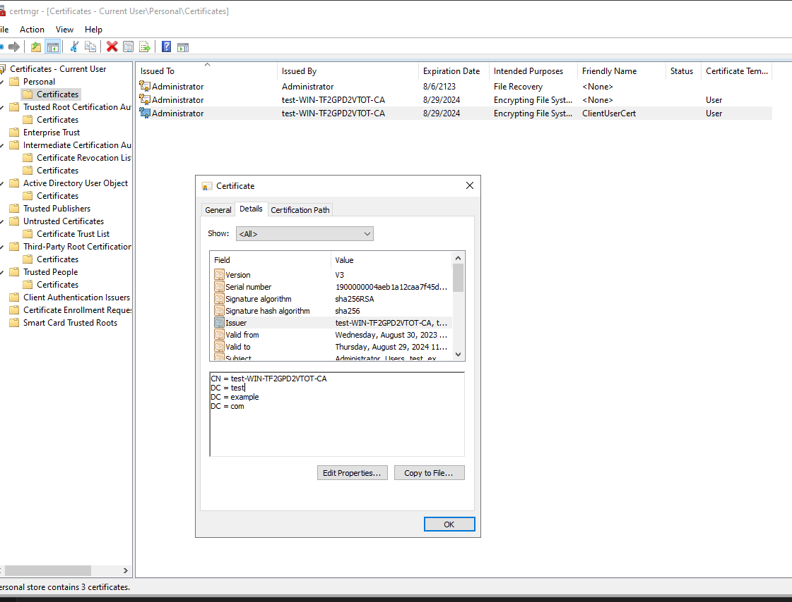

# Guide to setting up a Windows Server for Certificate Testing

This guide is used to set up a Windows Server for Windows Store Certificate Testing. This guide assumes you have downloaded a Windows 2022 Server ISO and have installed the Windows Server onto a virtual machine. Certificate Templates can only be installed on Windows Server and it must enabled as an Enterprise Certificate Authority. This guide is NOT meant to be a guide on how to set up a Windows Server for production use, and is meant only for setting up an environment to test the Grafana Agent and certificate store.

## Prerequisites

* The install should be fresh with no server roles defined or installed. 
* You should be logged in via an administrator account.

## Set up as domain controller

1. Add `Active Directory Domain Services`.
2. Add to a new forest, and when asked for a name, use `test.example.com`.
3. Add a NETBIOS name `TESTCERT`.
4. Continue the feature install until done.
6. Reboot. If the set up succeeded, your username will be prefixed with `TESTCERT/` on login screen.

## Set up certificate management

For this setup we are using a one-node Domain Controller set up as the Enterprise CA.

1. Go to the Server Management window.

2. Click Add Roles.

3. Select `Active Directory Certificate Services`.

4. Select `Certificate Authority`, and `Certificate Authority Web Enrollment`. Note that we will need the `Certificate Web Enrollment Service`, but it must be installed after the `Certificate Authority`.

5. Install and then select configure `Certificate Authority`.

6. Select `Enterprise CA`.

7. Select `Root CA`.

8. Select `Create a new private key`.

9. Go with the defaults.

10. Go with validity of 5 years.

11. Install.
12. When asked if you want to install additional services say yes.

13. Select `Certificate Enrollment Web Service`.
14. Use the default application pool identity.

15. Choose existing SSL certificate.

16. Click through and complete.
17. Reboot.

## Creating a template

1. From Server Management click Tools->Certificate Authority.

2. Ensure `Certificate Templates` is available, if not then you are not set up as an Enterprise CA and go back to `Setup as domain controller`.

3. Right-click on `Certificate Templates` and select `Manage`.

4. This opens the `Certificate Templates Console`.
5. Select `Authenticate Session` and `Duplicate`.
6. Open `General` tab and change names to `Certstore Template`, set the Renewal Period to 32850 hours that is the max allowed.

7. Open `Cryptography` tab and select `Request can use any provider available on the subject's computer`.

8. Open `Request Handling` tab and select `Allow private key to be exported`.

9. Open `Security` tab and give Administrator all the control.

10. Open `Extensions` tab click `Application Policies` click `Edit`, ensure `Any Purpose` is selected.

11. Close `Certificate Template Console`.
12. Reopen `Certificate Authority` console.
13. Right-click on `Certificate Templates`, select `New`, then `Certificate Template to Issue`.
14. Select `Certstore Template`.
15. It will now show in the Templates folder of Certificate Authority.

## Creating a certificate from the template

1. Open `certmgr` also called `Manage user certificates` from the Run button.
2. Expand `Personal`, right-click on personal, select `All Tasks` , select `Request New Certificate`.
3. Click through until you get the `Request Certificate` screen and select `Certstore Template`.

4. Expand `Certstore Template` and select `Properties`.
5. Give it a name  like `TestAuth` and ensure under `Private Key` -> `Key options` that the private key is exportable.

6. Create Certificate.

## Export the certificate

1. From `certmgr` find the certificate you created and double click to open.
2. Go to the `Details` tab and select `Copy to File...`.
3. Ensure that `Allow private key to be exported` is selected.

4. Under `Export File Format` ensure that `Include all certificates in the certificate path if possible`.
5. Export it to a file.

## Setup Grafana Agent

1. Open the Agent configuration file.
2. Open `Certificate Templates Console`, right-click `Certstore Template` and find the Object identifier.

3. Copy the configuration file.
4. Find the common name, it is `test-WIN-TF2GPD2VTOT-CA` in the screenshot.

5. Copy that to the configuration.
6. Configuration should look like this.

7. Start Agent.

## Copy certificate to browser

1. Open browser.
2. Find certificate management.
3. Add certificate we exported in `Export the certificate`.
4. Browse to `http://localhost:12345/metrics`, and it should work properly. You may need to tell it to trust the certificate though.

