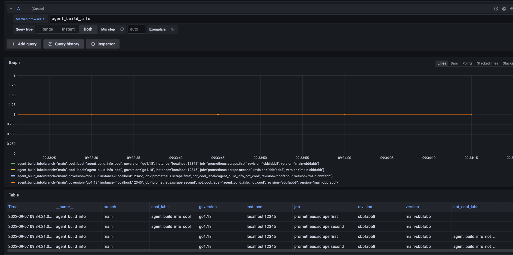

---
aliases:
- /docs/agent/latest/flow/tutorials/chaining
title: Chaining components
weight: 400
---

The goal of this tutorial is to show how to use [multiple-inputs.flow](../assets/flow_configs/multiple-inputs.flow) to send data to several different locations. This tutorial uses the same base as [Filtering metrics]().

A new concept in Flow is chaining components together. 

# Prerequisites

* [Docker](https://www.docker.com/products/docker-desktop)
* Clone the [Agent Repository](https://github.com/grafana/agent) `git clone git@github.com:grafana/agent.git`

## Example

To run the example execute `docker-compose -f ./assets/multiple-inputs.yaml up` from the tutorials directory. 

Allow the Agent to run for two minutes then go to [Grafana](http://localhost:3000/explore?orgId=1&left=%5B%22now-1m%22,%22now%22,%22Cortex%22,%7B%22refId%22:%22A%22,%22instant%22:true,%22range%22:true,%22exemplar%22:false,%22expr%22:%22agent_build_info%22%7D%5D).



There are four series&mdash;two scrapers each sending metrics to both filters, so you end up with 4 series. They differ in `job` and `cool_label/not_cool_label`.

## Multiple outputs

```river
prometheus.scrape "first" {
    targets = [{"__address__" = "localhost:12345"}]
    forward_to = [prometheus.relabel.filter.receiver,prometheus.relabel.not_cool.receiver]
    scrape_config {
        job_name = "first"
    }
}
```

In the above Flow block, `forward_to` accepts an array of `receivers`. In previous examples, a single receiver was used, but the use of multiple inputs and outputs is a basic building block of Flow. In the above example, `prometheus.scrape.first` is sending to both `prometheus.relabel.filter` and `prometheus.relabel.not_cool`. 

## Multiple Inputs

```river
prometheus.relabel "cool" {
    metric_relabel_config {
        source_labels = ["__name__"]
        regex = "(.+)"
        replacement = "${1}_cool"
        target_label = "cool_label"
    }
    forward_to = [prometheus.remote_write.prom.receiver]
}

prometheus.relabel "not_cool" {
    metric_relabel_config {
        source_labels = ["__name__"]
        regex = "(.+)"
        replacement = "${1}_not_cool"
        target_label = "not_cool_label"
    }
    forward_to = [prometheus.remote_write.prom.receiver]
}

prometheus.remote_write "prom" {
    remote_write {
        url = "http://cortex:9009/api/prom/push"
    }
}
```

In the above flow blocks the `prometheus.remote_write.prom` receives input from both the `prometheus.relabel.cool` and `prometheus.relabel.not_cool`. 


