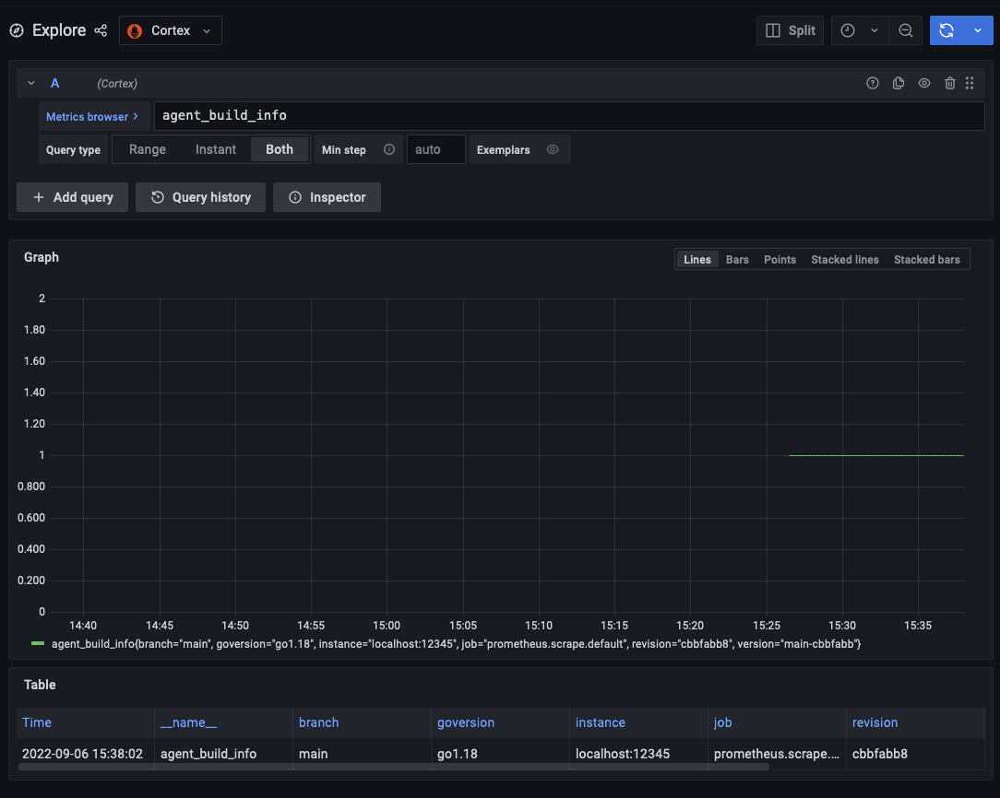

---
aliases:
- /docs/agent/latest/flow/tutorials/scraping-the-agent
title: Your first component
weight: 100
---

# Scraping the Agent

To quickly spin up an example enviroment run the following. `docker-compose -f ./assets/scraping-the-agent.yaml` with the [flow file](./assets/scraping/agent.flow). Allow the service to run for a few minutes and you should be able to navigate to the [metrics browser](http://localhost:3000/explore?orgId=1&left=%5B%22now-1h%22,%22now%22,%22Cortex%22,%7B%22refId%22:%22A%22,%22instant%22:true,%22range%22:true,%22exemplar%22:false,%22expr%22:%22agent_build_info%22%7D%5D). 



This example scrapes the Grafana Agent's `http://localhost:12345/metrics` endpoint and pushes those metrics to the cortex instance. 


## Scraping

This is the `prometheus.scrape` component from the [flow file](./assets/scraping/agent.flow).

```river
// prometheus.scrape is the type of component and "default" is the name or label of a component
prometheus.scrape "default" {
    // Tell the scraper to scrap at http://localhost:12345/metrics
    // the http:// and metrics are implied but able to be overwritten 
    targets = [{"__address__" = "localhost:12345"}]
    // Forward the scrape results to the receiver, in general 
    // Flow uses forward_to to tell which receiver to send results to. 
    // The forward_to is an argument of prometheus.scrape.default  and 
    // the reciever is an export prometheus.remote_write.prom
    forward_to = [prometheus.remote_write.prom.receiver]
    scrape_config {
        job_name = "scrape_agent"
    }
}
```

### Component

The component is [`prometheus.scrape`](../reference/components/prometheus.scrape.md), which is responsible for scraping the metrics a particular endpoint and passing them on to another component.

