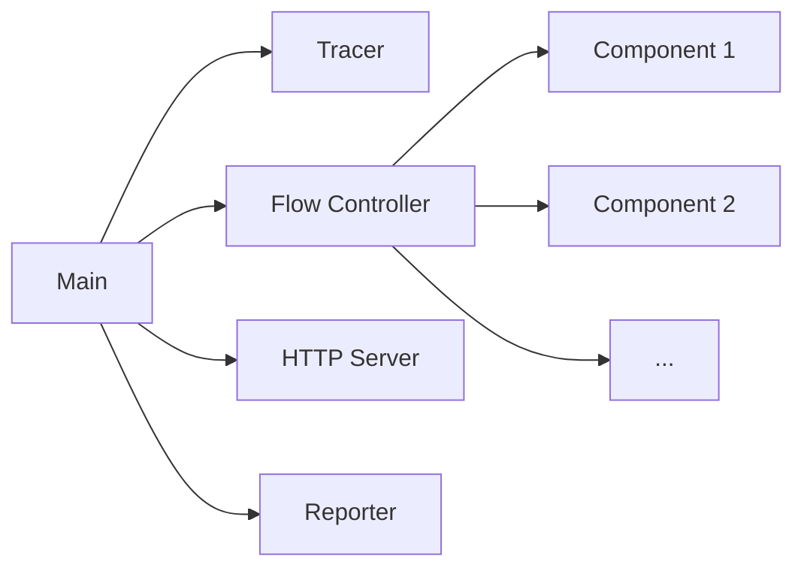

---
aliases:
- ../../concepts/concurrency/
title: Concurrency
weight: 100
---

# Concurrency

Grafana Agent Flow makes heavy use of concurrency to run tasks and communicate between them. This page explains the big picture concurrency used but it is not all encompassing. For example, a [component] is very likely to use concurrency to run even more subtasks.

In this page we will discuss concurrency for the following tasks:

## Table of Contents
- [Main](#main)
- [Tracer](#tracer)
- [Flow Controller](#flow-controller)
- [HTTP Server](#http-server)
- [Reporter](#reporter)
- [Component](#component)

# Main

- gets the run mode
- starts the following goroutines: tracer, flow controller, http server, reporter

# Tracer

- emits traces for the agent

# Flow Controller

- starts a goroutine for each component in the flow config

# HTTP Server

- agent flow endpoints for emitting metrics, reloading config, etc

# Reporter

- reports usage of enabled components

# Component

- 1 of these is started for each component in the river config