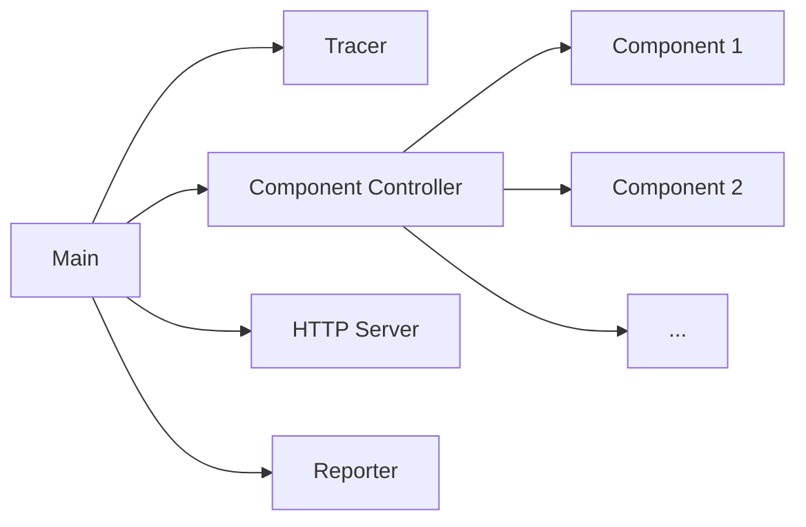

---
aliases:
- ../../concepts/concurrency/
title: Concurrency
weight: 400
---

# Concurrency

Grafana Agent Flow makes heavy use of concurrency to run tasks and communicate between them. This page discusses the big picture concurrency used by Flow but it is not all encompassing for concurrency in Flow. For example, a component is very likely to use concurrency to run additional subtasks.

## Table of Contents
- [Main](#main)
- [Tracer](#tracer)
- [Component Controller](#component-controller)
- [HTTP Server](#http-server)
- [Reporter](#reporter)
- [Component](#component)

# Main

This is the entrypoint for Flow. It determines the run mode and for flow launches the following tasks:
- Tracer
- Component Controller
- HTTP Server
- Reporter

# Tracer

This task emits traces for itself that can be forwarded another component that accepts `otelcol` tracers. More details can be found [here](../reference/config-blocks/tracing.md)

# Component Controller

The Component Controller manages components at runtime. More details can be found [here](./component_controller.md)

# HTTP Server

Starts an HTTP server with endpoints for:
- Emitting metrics
- Reloading config
- The Graph UI for debugging
- etc.

# Reporter

This task reports occassional usage stats to grafana.com. It can be managed using the command line as documented [here](../reference/cli/run.md)

# Component

Components are the building blocks of Grafana Agent Flow. More details can be found [here](./components.md) and component specific details can be found [here](../reference/components/)