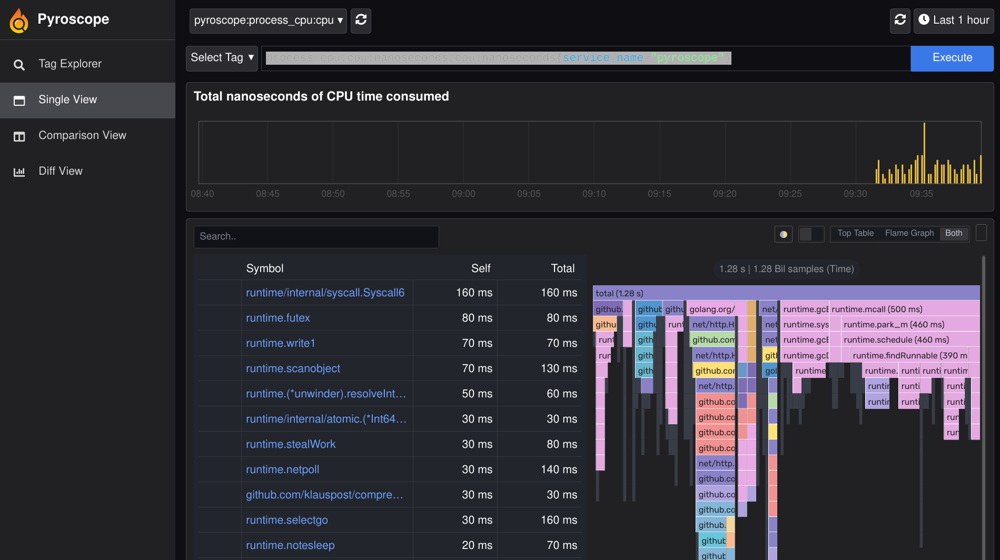
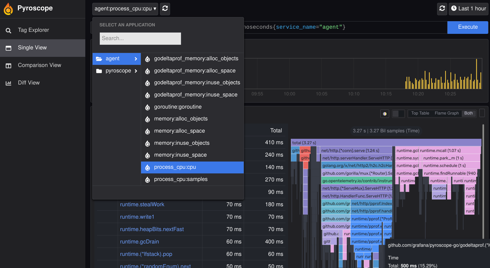
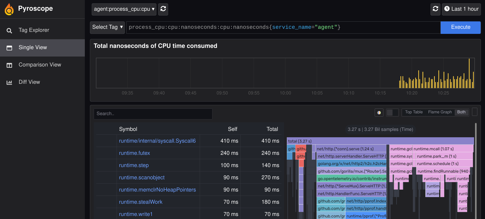

---
aliases:
- /docs/grafana-cloud/agent/flow/tasks/using-pyroscope/
canonical: https://grafana.com/docs/agent/latest/flow/using-pyroscope/
description: Learn how to use Pyroscope 
title: Learn how to use Pyroscope 
weight: 300
---

# Learn how to use Pyroscope

Learn how to configure  to collect [Pyroscope][] profiles and forward them to a [Pyroscope Server][].

This topic describes how to:

* Setup [Pyroscope Server][].
* Setup  to collect profiles and send them to [Pyroscope Server][].

## Components used in this topic

* [pyroscope.write][]
* [pyroscope.scrape][]

## Before you begin

* Download .

## Setup Pyroscope

The easiest path to setting up Pyroscope is using `docker run -it -p 4040:4040 grafana/pyroscope`. This will spin up a docker instance running Pyroscope on port `4040`. The server will autoscrape itself and after a few minutes data will appear. If you immedietly access the server it may error with `No applications available` until it has scraped itself.  



## Setup 

Download the [latest][] version of  for the system your are running. 

Add the below configuration to `agent.river` file in the same diretory as the file downloaded above.

```
pyroscope.scrape "agent" {
        targets    = [{"__address__" = "localhost:12345", "service_name" = "agent"}]
        forward_to = [pyroscope.write.local.receiver]

        profiling_config {
                profile.process_cpu {
                        enabled = true
                }

                profile.godeltaprof_memory {
                        enabled = true
                }
       }
}

pyroscope.write "local" {
        endpoint {
                url = "http://localhost:4040"
        }
}
```

The above configuration will scrape the `localhost:12345/-/pprof` endpoint for cpu and memory evey 60 seconds and send those profiles to the Pyroscope server that was setup earlier. The `localhost:12345` endpoint is the default host and port for .

## Run 

Run  with `AGENT_MODE=flow ./grafana-agent-linux-amd64 run ./agent.river`. The exact executable name will change depending on the platform. Wait 2 minutes, this will give time for startup and a scrape to occur.

Open `http://localhost:4040` in a web browser.

Select `agent` from the dropdown. This name is derived from `service_name` specified in `agent.river`.



Then select any cpu or metric you want to view.



## Using Pyroscope with Grafana Cloud

## Additional links

* [Set up Go profiling in pull mode][]

[latest]: https://github.com/grafana/agent/releases/latest
[Set up Go profiling in pull mode]: https://grafana.com/docs/pyroscope/v1.2.x/configure-client/grafana-agent/go_pull/
[Pyroscope Server]: https://github.com/grafana/pyroscope#-quick-start-run-pyroscope-locally

{}
[pyroscope.write]: "docs/agent/ -> /docs/agent/<AGENT_VERSION>/flow/reference/components/pyroscope.write.md"
[pyroscope.scrape]: "docs/agent/ -> /docs/agent/<AGENT_VERSION>/flow/reference/components/pyroscope.scrape.md"
{}
