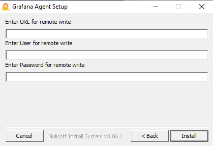
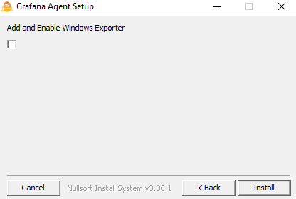

# Windows Installation

## Overview

The installer will install Grafana Agent into the default directory `C:\Program Files (x86)\Grafana Agent`, optionally you can select to enable the [Windows Exporter](https://github.com/grafana/windows_exporter) with all default options. 

## Installation



**Remote Write** is used to specify any compatible Prometheus Endpoint. **User** and **Password** are used for basic auth. This will generate a configuration snippet like the below.

```
  remote_write:
    - url: https://example.com
      basic_auth:
        username: "legit_username"
        password: "legit_password"
```

<br>



Selecting the checkbox will enable the Windows Exporter, serving metrics from `http://localhost:12345/integrations/windows_exporter/metrics`.

After installation ensure that you can reach `http://localhost:12345/-/healthy` and `http://localhost:12345/agent/api/v1/targets`. 

If Grafana Agent is re-installed and an agent-config.yaml already exists it will not overwrite the existing one.

## Silent Installation

Silent installation can be achieved via 
`grafana-agent-installer.exe /S /RemoteURL "https://example.com" /RemoteUser "user_name" /RemotePassword "password" /EnableExporter "true"`

EnableExporter enables/disables the Windows Exporter

## Security

The Agent configuration is installed alongside the Agent itself, by default. Depending on your configuration, you may not want that for security reasons and may instead want to make it protected. The configuration is by default stored in `C:\Program Files (x86)\Grafana Agent`.

## Uninstall

Via Remove Programs or uninstaller.exe in the directory the Agent is installed in. This will turn off and remove the Agent then delete any installed files in the applications directory.

## Logs

Logs are currently not stored anywhere for the services bersion of Agent, in the future logs will be available via Event Viewer.