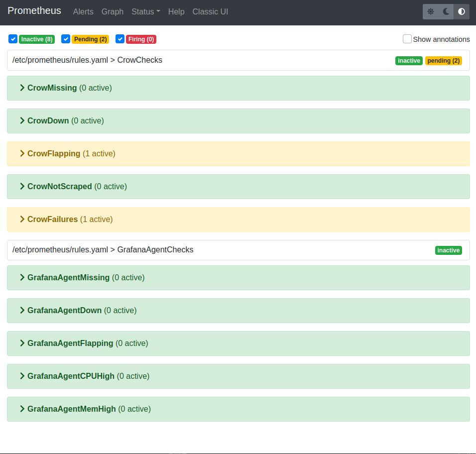
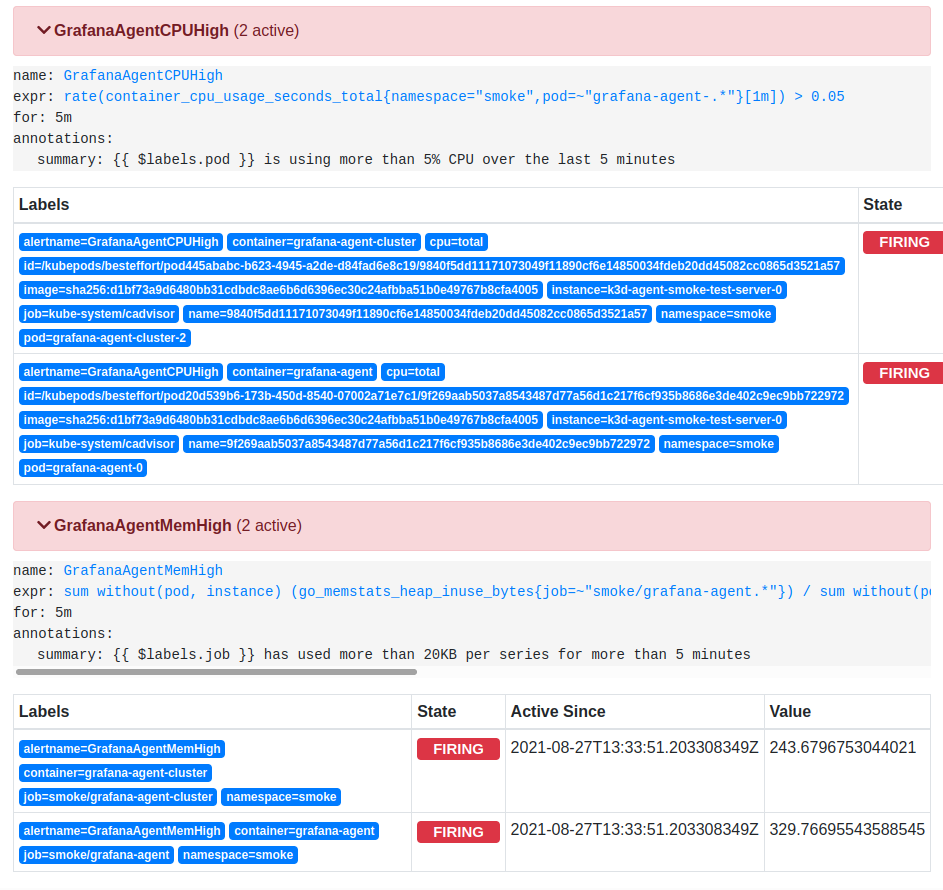
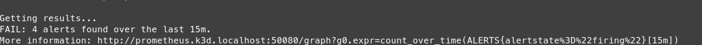
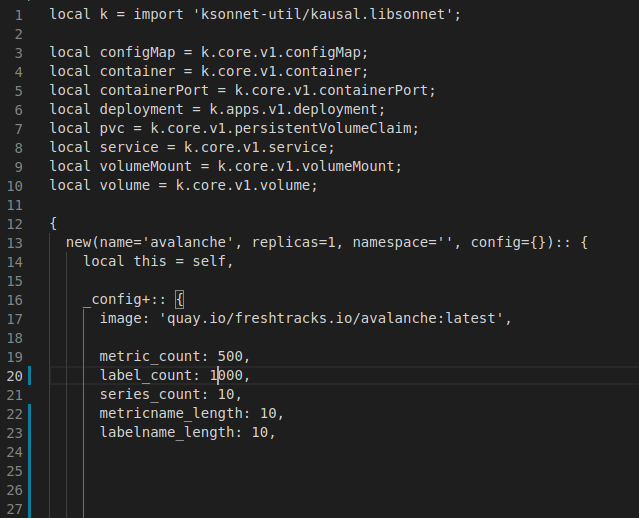
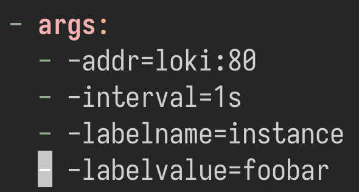
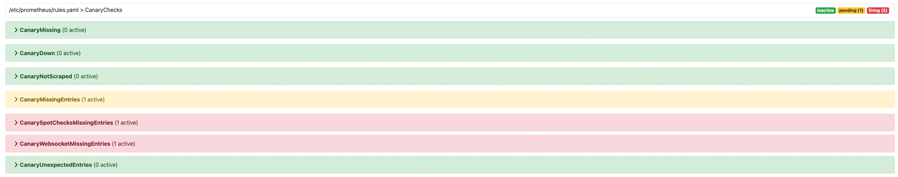
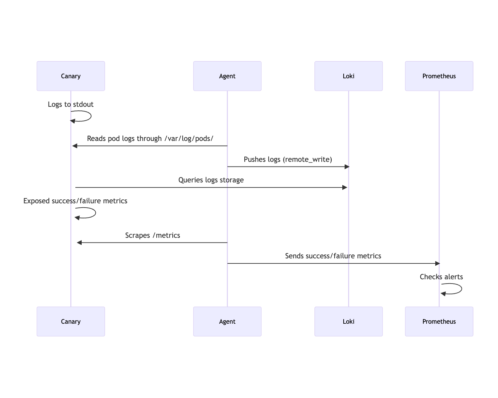
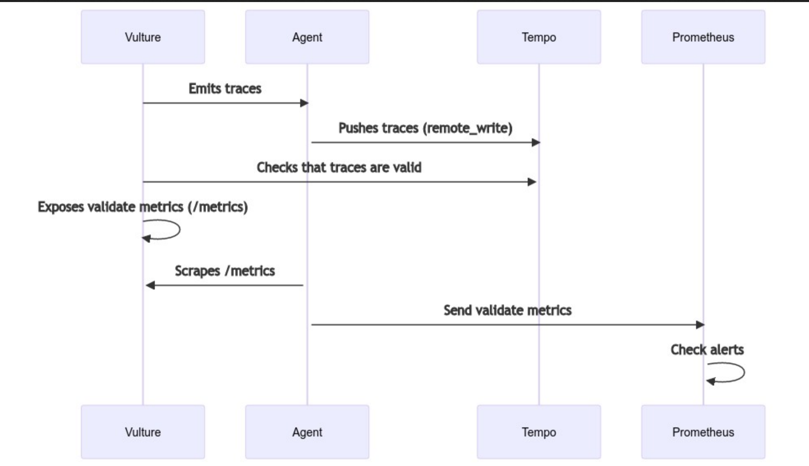

# `k3d` Examples

## Agent Environment

The `k3d` example uses `k3d` and `tanka` to produce a Kubernetes environment
that implements a full Grafana Agent environment for testing.

### Requirements

- A Unix-y command line (macOS or Linux will do).
- Kubectl
- Docker
- [Tanka >= v0.9.2](https://github.com/grafana/tanka)
- [k3d >= v4.0.0,<= v5.2.2](https://github.com/k3d-io/k3d)
- [jsonnet-bundler >= v0.4.0](https://github.com/jsonnet-bundler/jsonnet-bundler)

### Getting Started

Build latest agent images with `make agent-image agentctl-image` in the project root directory if there are local changes to test.

Run the following to create your cluster:

```bash
# Create a new k3d cluster
./scripts/create.bash

# Import images into k3d if they are not available on docker hub
k3d image import -c agent-k3d grafana/agent:main
k3d image import -c agent-k3d grafana/agentctl:main

# Ensure jsonnet is up to date before applying environment
jb install
tk apply ./environment

# Navigate to grafana.k3d.localhost:30080 in your browser to view dashboards

# Delete the k3d cluster when you're done with it
k3d cluster delete agent-k3d
```

## Smoke Test Environment

The smoke test environment is used for end-to-end validation of all three observability signals.

### Running

Smoke Test environment is invoked via `/scripts/smoke-test.bash`

This tool will spin up cluster of Grafana Agent, Cortex, Avalanche, Smoke, [Crow](../../tools/crow/README.md), [Canary](https://grafana.com/docs/loki/latest/operations/loki-canary/) and Vulture instances. The Smoke deployment will then periodically kill instances and check for any failed alerts. At the end of the duration (default 3h) it will end the testing.

For users who do not have access to the `us.gcr.io/kubernetes-dev` container registry, do the following to run the smoke test:

* Build the Smoke and Crow images locally (from the root project directory):
```
make grafana-agent-crow-image agent-smoke-image
```
* Run the smoke test using `/scripts/smoke-test.bash` script.
* `Smoke` and `Crow` pods will fail because the images are not imported into the cluster. Import them running:
```
k3d image import -c agent-smoke-test us.gcr.io/kubernetes-dev/grafana/agent-smoke:main
k3d image import -c agent-smoke-test us.gcr.io/kubernetes-dev/grafana/agent-crow:main
```

### What to look for?

These alerts are viewable [here](http://prometheus.k3d.localhost:50080/alerts).

Prometheus alerts are triggered:
- If any Crow instances are not running or Crow samples are not being propagated correctly.
- If any Canary instances are not running or Canary logs are not being propagated correctly.
- If any Vulture instances are not running or Vulture samples are not being propagated correctly.
- If any Grafana Agents are not running or Grafana Agent limits are outside their norm.

NOTE: The alerts might be in pending until the system settles down.



An alert firing will look similar to the below.



If at the end of the test any issues are found they will look similar to the below.



### How to trigger an alert?

Changing the avalanche setting for label_count to 1000, located [here](../../production/tanka/grafana-agent/smoke/avalanche/main.libsonnet). This will ensure the [GrafanaAgentMemHigh](http://prometheus.k3d.localhost:50080/graph?g0.expr=ALERTS%7Balertname%3D%22GrafanaAgentMemHigh%22%7D&g0.tab=1&g0.stacked=0&g0.show_exemplars=0.g0.range_input=1h.) alert exceeds the limit.



For Loki Canary, the easiest way to trigger an alert is to edit its Daemonset to query for a different label that doesn't exist.



### Architecture

By default, a k3d cluster will be created running the following instances

- agent-single - single instance
- agent-cluster - 3 Grafana Agents in clustered configuration
- crow-cluster - serves the agent cluster
- crow-single - serves the single agent
- cortex
- avalanche - selection of avalanche instances serving traffic
- smoke - scales avalanche replicas and introduces chaos by deleting agent pods during testing
- canary - emits logs and checks if they're stored properly
- loki
- vulture - emits traces and checks if they're stored properly
- tempo

Crow, Canary and Vulture instances will check to see if the metrics, logs and traces that were scraped respectively, show up in the Cortex/Loki/Tempo instances. They will then emit metrics on the success of those metrics. This success/failure result will trigger an alert if it is incorrect.

### Metrics Flow


### Logs Flow



### Traces Flow



### Avalanche

Avalanche is used to add some additional load on the system and general testing.
